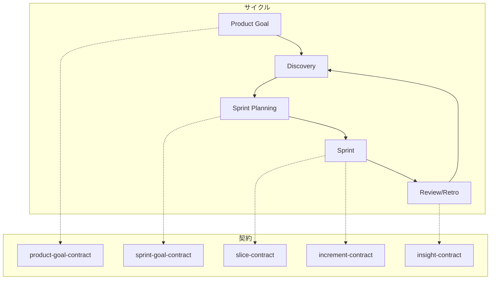
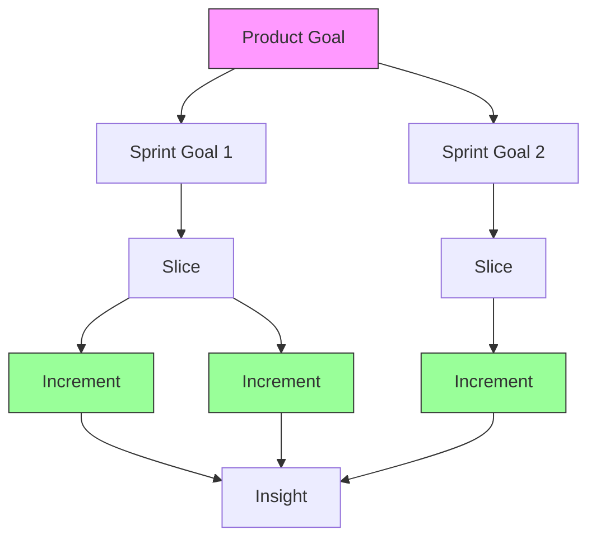

# agent-harness

> 最終判断だけを人間が担い、それ以外は AI チームが自律的に進める

---

## このドキュメントの契約

| 項目 | 内容 |
|------|------|
| **価値** | 最終判断以外を AI チームに委譲できる |
| **やめる条件** | 3ヶ月後に「何を判断すべきかわからない」が 50% 超 |
| **検証方法** | 実験 → 仮説の支持/棄却を記録 |

---

## 問題と解決策

**問題**: 単一 AI は平凡化するか暴走する

**解決策**: 3つの仕組みで AI チームを構成する

| 仕組み | 効果 | 検証状況 |
|--------|------|----------|
| **ペルソナ注入** | 一貫した判断軸を維持 | ✅ 検証済み |
| **相互監視** | 盲点をカバー | ✅ 検証済み |
| **契約** | 合意を明文化 | ✅ S3-S4 で検証済み |

### 課題タイプと推奨パターン

| 課題タイプ | ペルソナ | 相互監視 | 推奨 |
|-----------|---------|---------|------|
| 戦略的意思決定 | 高 | 高 | ペルソナ + 相互監視 |
| メンタルモデル診断 | 高 | 高 | ペルソナ + 相互監視 |
| 設計方針の決定 | 高 | 中 | ペルソナ |
| 曖昧な問題の構造化 | 高 | 中 | ペルソナ |
| コードレビュー | 中 | 高 | 相互監視 |
| 単純なコード実装 | - | - | 素の AI |
| 定型作業 | - | - | 素の AI |

---

## 抽象概念

### 場（Place）

ステークホルダーが集まり、契約を作成・レビュー・承認する環境

### 契約（Contract）

合意を明文化したもの。価値、検証方法、やめる条件を含む

### ステークホルダー（Stakeholder）

契約に関与する人間または AI。役割: approver / reviewer / informed

---

## ワークフロー



---

## 場の一覧

| 場 | 目的 | 出力（契約） |
|---|------|-------------|
| **Discovery** | 問題を発見し仮説を検証 | （プロセス、契約なし） |
| **Sprint Planning** | スプリント目標を決める | sprint-goal-contract |
| **Sprint Review** | Increment を検証 | insight-contract |
| **Sprint Retro** | プロセスを振り返る | insight-contract |

**設計判断**: 場を 4 つに絞り、必要に応じて追加する（YAGNI）

---

## 契約の一覧

| 契約 | 決めること | 安定度 |
|------|-----------|--------|
| **product-goal-contract** | プロダクトの価値、やめる条件 | 高（複数スプリント） |
| **sprint-goal-contract** | スプリントの焦点（なぜ） | 中（スプリント単位） |
| **slice-contract** | 価値の分類（必須/既知/未知） | 中 |
| **increment-contract** | 成果物と完了条件（DoD） | 低（随時更新） |
| **insight-contract** | 学び、根拠、次のアクション | 蓄積 |

### 契約の階層



**重要**:
- **Sprint Goal** = Product Goal のバーティカルスライス（価値検証単位）
- **Slice** = 価値の分類（必須/既知/未知）
- **Increment** = Product Goal へ向かう具体的なステップ
- **Insight** = 学びの記録と還元

### 契約と Git ワークフローの対応

| 契約レイヤー | Git 対応 | 理由 |
|-------------|----------|------|
| Sprint Goal | ブランチ不要 | Sprint は「焦点」であり、コード単位ではない |
| **Increment** | **feature ブランチ / PR** | 検証可能な成果物単位 |
| 個別変更 | **コミット** | 論理的な変更単位 |

```
main
 └── feat/INC-S3-001-xxx  ← Increment 単位でブランチ
      ├── commit: 構造変更
      ├── commit: 内容追加
      └── commit: テスト追加
      → PR & マージ（Increment 完了ごとに即プッシュ）
```

---

## 原則（P1-P7）

| # | 名前 | 要点 |
|---|------|------|
| P1 | コンテキスト分離 | 役割ごとにエージェントを分ける |
| P2 | 契約で合意 | コードの前に契約を作る |
| P3 | 道具を減らす | 使わないものは消す |
| P4 | 知識を蓄積 | 学びをルール/スキルに還元する |
| P5 | ペルソナ注入 | 著名人やステークホルダーの視点を借りる |
| P6 | 相互監視 | 最低2人、異なる盲点を持つチーム |
| P7 | 契約で価値をつなぐ | Product Goal → Sprint Goal → Slice → Increment |

---

## 成功指標

| 指標 | 目標 |
|------|------|
| 契約活用率 | 80% 以上 |
| 手戻り率 | 10% 以下 |
| 自律度 | 6ヶ月で介入頻度 50% 減 |

---

## 参照

- [設計原理の詳細](philosophy.md)
- [貢献ガイド](contributing.md)
- [実験記録](../research/experiments/)
