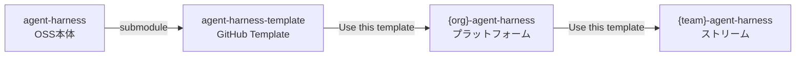
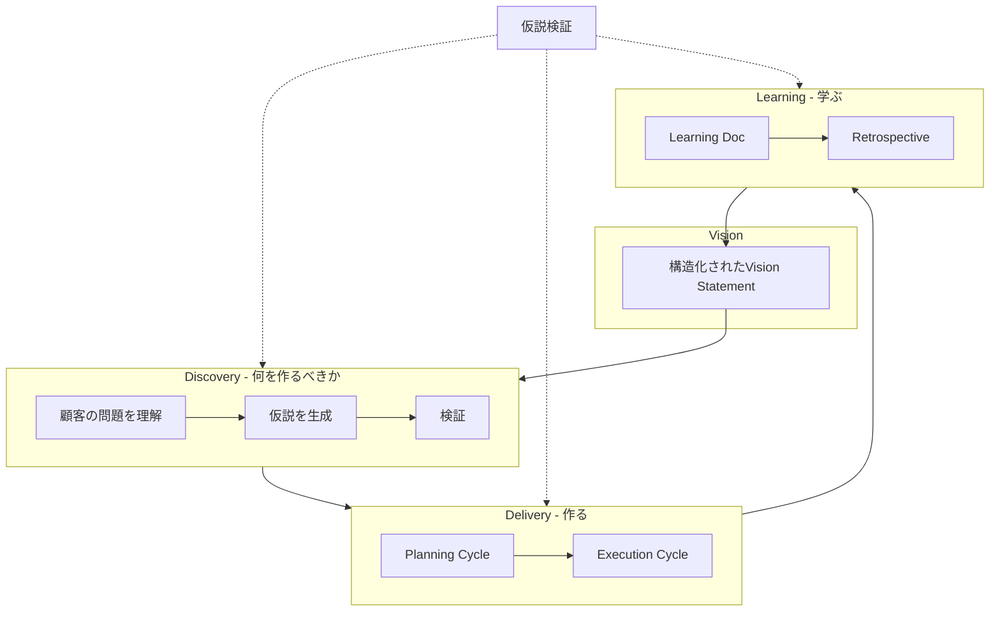

# VISION.md

> Agent Harness - 自律的に価値を届け続けるAIチームのハーネス

---

## 30秒ピッチ

```
AIに仕事を任せたい。でも、
一人のAIでは凡庸になるか、暴走する。

私たちは「ハーネス」を提供する。

著名人の人格を降ろした複数のAIが、
相互監視しながら動く。
いつ、何を、どう動くか。型を一気通貫で。

自律的に、人間らしく、価値を届け続ける。
覚悟だけは、あなたが引き取ればいい。
```

---

## 1. 問題：なぜハーネスが必要か

### 一人のAIの限界

```
一人のAIに任せると...
  → 凡庸になる（自己矛盾を解消してバランシング）
  → または暴走する（チェックがない）
  → 長時間任せられない（信頼できない）
```

### Real Pain Points

| ペルソナ | 痛み |
|---------|------|
| Product Owner | 戦略的思考に時間を使いたいが、調整業務に追われる |
| Tech Lead | 品質担保に責任を持つが、レビューがボトルネックになる |
| Engineer | コンテキスト理解に時間がかかり、実装に集中できない |
| Scrum Master | チームの障害を早期発見したいが、情報が散在している |
| Product Manager | 仮説の成否を追跡したいが、記録が残らない |

---

## 2. 解決策：ハーネスとは

### Vision Statement（Mad Libs形式）

```
Today, ストリームアラインドチームは
「一人のAIでは凡庸になるか、暴走する」問題を抱えている。

This is because
「AIの自己バランシング」と「監視の欠如」。

We envision
「著名人の人格を降ろした複数のAIが相互監視する」世界。

We are building
「ハーネス」—型を一気通貫で提供する仕組み。

Through which
「自律的に、人間らしく、価値を届け続ける」。
```

### One-Liner

> 「覚悟」のみを人間が引き取り、それ以外は自律的に遷移し続ける開発組織を実現する。

### ハーネスの構成要素

| 要素 | 役割 | 単体で機能するか |
|------|------|-----------------|
| **複数AIの相互監視** | 誰が動くか | ❌ 型がないと暴走する |
| **型（イベント/フロー）** | いつ、何をするか | ❌ 誰がやるか決まってない |
| **中間生成物** | 何で合意するか | ❌ 作る人がいない |
| **学習サイクル** | どう進化するか | ❌ 還流先がない |

**一気通貫で提供しないとワークしない。**

### 届け方：GitHub Template チェーン



---

## 3. 著名人の人格を降ろす理由

### なぜ著名人の人格を降ろすか：メンタルモデルの継承

```
目的：
  1. メンタルモデルを継承する
     → 著名人は思考の枠組みを外部発信している
     → その枠組みをAIにインストールできる
  
  2. 判断基準に一貫性を持たせる
     → 著名人の判断軸は公開されている
     → 一貫した基準でAIが判断できる
  
  3. AIの学習基盤を最大限利用する
     → LLMは著名人の発言・著作を学習済み
     → 追加の学習なしで人格を再現できる

副次的効果：
  → 完璧な超人を作ろうとしない
  → 自己矛盾を解消してバランシングしない
  → 特定の視点を維持できる
```

### でも一貫した判断基準は一貫した失敗パターンを持つ

```
一貫した判断基準
  → 同じ盲点を持ち続ける
  → 同じ失敗を繰り返す
  → 一人では気づけない
```

### だから異なるメンタルモデルを持つ複数でカバーする

> 仕事の最低人数は2〜3人。それをメタ的に見るコーチがいれば、自律的に仕事をし続けられる。
> AIもこれは同様。

```yaml
原則:
  - 異なるメンタルモデルを持つ複数のAI
  - 互いの盲点をカバーする
  - 最低2人、理想は3人以上
  - メタ的に見るコーチがいると、より安心

構成は固定しない:
  - タスクに応じて最適な編成は変わる
  - 役割も固定ではなく、動的に決まる
  - 必要なのは「異なる失敗パターンを持つこと」
```

### 多視点セッション

異なるメンタルモデルを持つサブエージェント同士で提案を応酬し、統合提案を生み出す。

```yaml
流れ:
  1. 各自がベストな提案を出す
  2. 提案をぶつけ合う
  3. お互いの盲点に気づく
  4. 再提案 / 反論
  5. 統合提案を出す

アウトカム:
  - 統合提案（根拠付き）
  - 各視点の盲点がどうカバーされたか
```

---

## 4. 全体フロー：Discovery → Delivery → Learning

### なぜDiscoveryが必要か

```
Discoveryがないと...
  → 間違ったものを効率的に作るリスク
  → 「何を作るべきか」が曖昧なまま進む
  → 顧客の問題を解決しない
```

### 全体ループ



### Discovery Cycle（何を作るべきかを発見する）

| イベント | 人間の役割 | AIの役割 | 中間生成物 | 検証する仮説 |
|---------|-----------|---------|-----------|-------------|
| 顧客理解 | インタビュー | 整理、パターン抽出 | Customer Insights | 「この問題が存在する」 |
| 仮説生成 | 方向性決定 | 選択肢提示 | Hypothesis List | 「この解決策が有効」 |
| プロトタイプ | フィードバック収集 | 作成支援 | Prototype | 「顧客が使う」 |
| 検証 | 判断 | データ収集 | Validation Report | 「作るべきか」 |

### Planning Cycle（どう作るかを決める）

| イベント | 人間の役割 | AIの役割 | 中間生成物 | 検証する仮説 |
|---------|-----------|---------|-----------|-------------|
| Vision定義 | 承認、覚悟 | 構造化支援 | Product Vision Doc | 「このVisionが正しい」 |
| Backlog精緻化 | 優先順位決定 | 情報収集 | Refined PBI | 「この順序が最適」 |
| Sprint Goal設定 | 合意形成 | 提案 | Sprint Goal | 「このGoalが達成可能」 |
| Sprint Backlog確定 | 最終確認 | サイズ見積もり | Sprint Backlog | 「このスコープが適切」 |

### Execution Cycle（作る）

| イベント | 人間の役割 | AIの役割 | 中間生成物 | 検証する仮説 |
|---------|-----------|---------|-----------|-------------|
| Intent定義 | Why確認 | Spec作成 | Intent Spec | 「この意図が正しい」 |
| Spec生成 | IF確認 | 自動生成 | Slice Spec | 「この設計が正しい」 |
| テスト実装 | - | 自動実装 | Test Code | 「このテストで検証できる」 |
| 実装 | - | 自動実装 | Code | 「この実装が正しい」 |
| 受け入れ確認 | 最終承認 | 自動検証 | Verification Report | 「完了した」 |

### 中間生成物での合意

| 中間生成物 | 役割 |
|-----------|------|
| **契約** | API/イベント/データの入出力仕様 |
| **失敗モード** | 何が壊れうるか、その影響と対策 |
| **テスト戦略** | 何が証明書になるか、どのレベルで検証するか |
| **計測設計** | 成功/失敗を何で判定するか |

---

## 5. 価値を届け続ける

### Learning Cycle

| イベント | 人間の役割 | AIの役割 | 中間生成物 | 検証する仮説 |
|---------|-----------|---------|-----------|-------------|
| Learning記録 | 振り返り参加 | 自動記録 | Learning Doc | 「この学びが有効」 |
| Retrospective | 改善決定 | 気づき整理 | Process Improvement | 「この改善が効く」 |
| ルール更新 | 承認 | 提案 | Updated Rules | 「このルールが機能する」 |
| Vision還流 | 方向修正 | 提案 | Updated Vision | 「Visionを修正すべき」 |

### 守破離の進化

```yaml
守（Phase 1 - まず型を学ぶ）:
  - スクラムのプラクティスを忠実に実装した型を提供
  - 中間生成物のフォーマット（Intent Spec, Slice Spec）
  - チェックポイントの配置
  - AIの役割: 型を提示し、逸脱を検知する
  - 検証: 型が機能するか

破（Phase 2 - 型を破る）:
  - 状況に応じて型をカスタマイズ
  - 「覚悟」と「それ以外」の境界が明確になる
  - 確認から監督へ、監督から例外介入へ
  - AIの役割: 学びに基づいて改善を提案する
  - 検証: カスタマイズが効果的か

離（Phase 3 - 型から離れる）:
  - 「協働」という概念自体が不要になる
  - 人間は覚悟のみを引き取る
  - AIは自律的に遷移パターンを学習する
  - 究極: 覚悟以外は全自動
  - 検証: 自律が機能するか
```

---

## 6. 覚悟：人間の役割

### 人間が引き取るもの

| ペルソナ | 究極の役割（覚悟） |
|---------|-------------------|
| Product Owner | Go/No-Go、撤退判断 |
| Tech Lead | 技術的な不可逆判断（アーキテクチャ選択、技術負債の受容） |
| Engineer | 新規領域の探索（前例のない実装への挑戦） |
| Scrum Master | チームの健全性の判断（人間的な側面） |
| Product Manager | 仮説の賭けを引き受ける |

### 究極形

```yaml
target:
  - AIが自律的に判断・実行・学習
  - 人間は技術的制約を埋める役割のみ
  - 技術的制約が解消されれば、人間の役割も解消される

note: |
  人がいなくても良い状況を基本的には目指す。
  覚悟もAIが持てるならそれでいい。
  AIができないことは「人間の役割」ではなく「技術的制約」。
```

### Kill Criteria（止める条件）

| 条件 | 閾値 | アクション |
|------|------|-----------|
| 覚悟の定義が機能しない | 3ヶ月後に50%以上が「何を引き取るべきか分からない」 | 覚悟の定義を再検討 |
| 関係性が固定化する | 6ヶ月後に役割分担が変化していないチームが70%以上 | 多視点セッション強化 |
| 自律化が進まない | 6ヶ月後に人間の介入頻度が導入時と±10%以内 | 学習メカニズム見直し |
| 開発速度が落ちる | 導入後2スプリントでベロシティが80%未満 | Human Checkpoint削減、改善なければ中止 |

---

## 7. 仮説と検証

### このVISIONの核心的な仮説

| 仮説 | リスク | 検証状況 |
|------|--------|---------|
| 多視点セッションは単一AIより意思決定の質が高い | 高 | **検証済み** |
| 著名人の人格インストールで判断の質が上がる | **最高** | **検証済み** |
| 複数AIの相互監視で信頼性が上がる | 高 | **検証済み** |
| 課題タイプによって人格効果が異なる | 中 | **検証済み** |
| 中間生成物での合意で手戻りが減る | 中 | 未検証 |
| Discovery Cycleで間違ったものを作るリスクが減る | 中 | 未検証 |
| 学習サイクルで進化し続ける | 中 | 未検証 |

### 検証済みの仮説

**H1: 著名人の人格インストールで判断の質が上がる**

- 実験日: 2026-01-27
- 結果: **支持される**（課題タイプ依存）
- 詳細: [research/experiments/2026-01-27_persona-installation-test.md](research/experiments/2026-01-27_persona-installation-test.md)

発見：
- 著名人の名前だけでも効果あり（一般的なロールより有効）
- 名前+哲学で最も効果が高い
- **判断が必要な課題で効果、実行課題で効果ゼロ**

**H2: 多視点セッションは単一AIより意思決定の質が高い**

- 実験日: 2026-01-27
- 結果: **支持される**
- 詳細: [research/experiments/2026-01-27_multi-perspective-session-test.md](research/experiments/2026-01-27_multi-perspective-session-test.md)

発見：
- 再考ラウンドで判断が変わる（Talebの例）
- 「残して検証が反脆弱的」という新しい視点

**H3: 複数AIの相互監視で信頼性が上がる**

- 実験日: 2026-01-27
- 結果: **支持される**
- 詳細: [research/experiments/2026-01-27_persona-installation-test.md](research/experiments/2026-01-27_persona-installation-test.md)

発見：
- エラー検出数: 単一AI 7 vs 相互監視 12
- Agent BがAgent Aの見落としを補完

### 課題タイプと推奨パターン

| 課題タイプ | 人格効果 | 相互監視効果 | 推奨 |
|-----------|---------|-------------|------|
| 戦略的意思決定 | **高** | 高 | 人格+相互監視 |
| メンタルモデル診断 | **高** | 高 | 人格+相互監視 |
| 設計方針の決定 | **高** | 中 | 人格 |
| 曖昧な問題の構造化 | **高** | 中 | 人格 |
| コードレビュー | 中 | **高** | 相互監視 |
| 単純なコード実装 | ゼロ | 低 | 素のAI |
| 定型作業 | ゼロ | 低 | 素のAI |

### 評価指標

「意思決定の質」で評価（結果ではなくプロセス）：
- 盲点の発見数
- 判断変更の発生
- 根拠の明確さ
- 新しい視点の追加
- アクションの具体性

---

## 付録

### 憲法（Constitution）- P1〜P6

| 原理 | 名前 | 核心 |
|------|------|------|
| P1 | コンテキスト競合の排除 | 役割分離された複数サブエージェントの同時稼働を前提とする |
| P2 | 中間生成物で合意を運ぶ | 契約・失敗モード・テスト戦略で意図と根拠を検査可能にする |
| P3 | 道具を減らす | 各スライスで減らせる道具を必ず評価する |
| P4 | 知識は資産として蓄積 | 知見をルール/スキル/ナレッジとして蓄積し、自動適用する |
| P5 | 著名人の人格インストール | イタコのように著名人を憑依させ、歪みを固定して凡人化を防ぐ |
| P6 | 複数エージェントによる相互監視 | 最低2人（ベスト3人）+ メタコーチで自律的に動く |

### エージェント構成例（参考）

> これは一例であり、固定ではない。タスクに応じて編成は変わる。

| 種類 | エージェント | 責任 | キャッチフレーズ |
|------|-------------|------|-----------------|
| 縦（プロセス特化） | PdM Agent (define) | Intent Spec作成 | 「ユーザー行動が変わらないなら作らない」 |
| 縦 | PdM Agent (verify) | 受け入れ確認 | 「Kill Criteriaを検証できないなら完了ではない」 |
| 縦 | TechLead Agent | Spec作成、テスト戦略 | 「失敗モードを定義できないなら設計ではない」 |
| 縦 | ScrumMaster Agent | 進捗可視化、障害検知 | 「チームが止まっているなら介入する」 |
| 縦 | Planning Agent | Sprint計画支援 | 「サイズがわからないならPBIに入れない」 |
| 横（ドメイン特化） | Repository Guardian | リポジトリ固有ルール | - |
| 横 | Domain Guardian | ドメイン知識 | - |

### Success Metrics

| 指標 | 目標 |
|------|------|
| 協働満足度 | 3ヶ月後に70%以上 |
| 中間生成物活用率 | 80%以上 |
| 学習還流率 | 50%以上 |
| 手戻り率 | 10%以下 |
| 自律度向上 | 6ヶ月で介入頻度50%減 |

### 反パターン

- ❌ 一人のAIに全てを任せる（凡庸化、暴走）
- ❌ 一つのプロンプトに全情報を詰め込む
- ❌ コードを書いてからテストを考える
- ❌ AIが自己バランシングして尖りを失う
- ❌ 編成表を作ってメンテナンスが必要になる
- ❌ 前提を問い直すことを目的化する
- ❌ 妥協案で丸くする（尖りを失う統合）
- ❌ 問いを投げっぱなしにする（提案しない）

### 参照ドキュメント

| カテゴリ | ファイル |
|---------|---------|
| 詳細ビジョン | [research/slices/product-vision/intent-spec.yaml](research/slices/product-vision/intent-spec.yaml) |
| 原則（SSoT） | [source/source/_shared/principles.yaml](source/source/_shared/principles.yaml) |
| アーキテクチャ | [research/proposals/2026-01-27_scrum-level-harness-architecture.md](research/proposals/2026-01-27_scrum-level-harness-architecture.md) |
| 多視点セッション詳細 | [research/proposals/2026-01-27_friction-induced-c.md](research/proposals/2026-01-27_friction-induced-c.md) |
| OSS戦略 | [research/plans/oss-strategy.md](research/plans/oss-strategy.md) |

---

> このドキュメントはDiscovery → Delivery → Learningのループ構造で再構成されています。
> 全てのフェーズで「検証する仮説」を明示し、仮説駆動で進化します。
