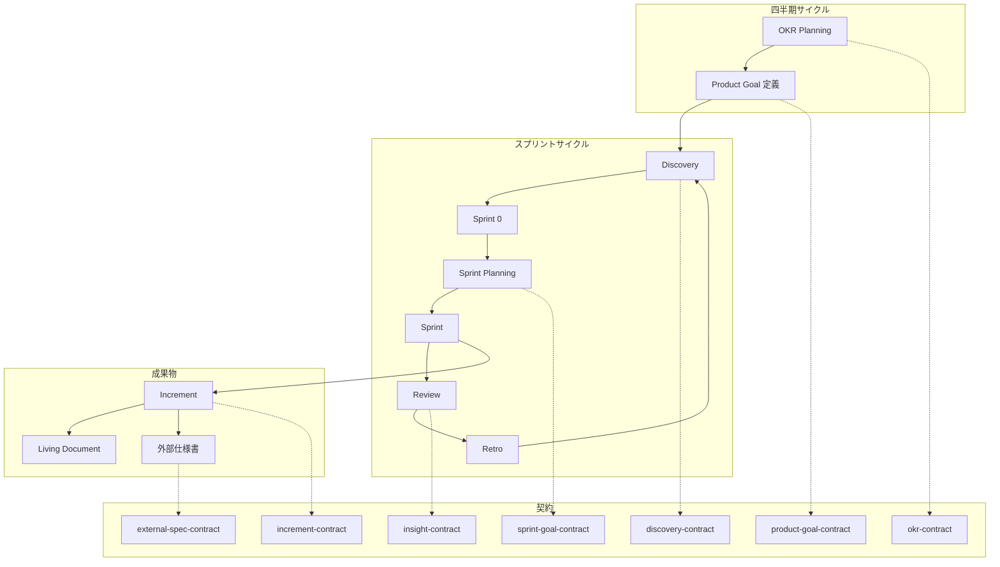
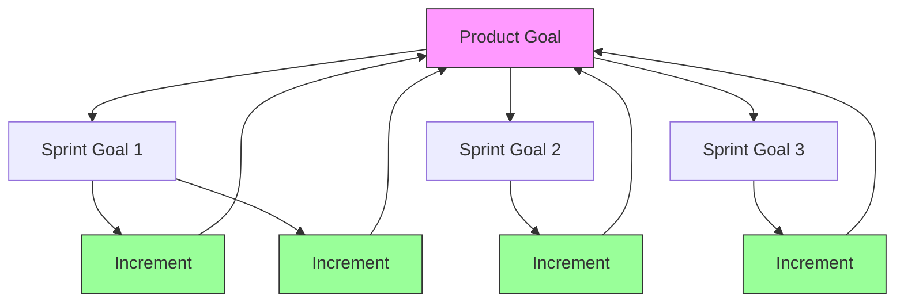
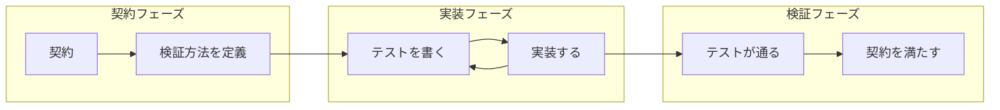

# agent-harness

> 最終判断だけを人間が担い、それ以外は AI チームが自律的に進める

---

## このドキュメントの契約

| 項目 | 内容 |
|------|------|
| **価値** | 最終判断以外を AI チームに委譲できる |
| **やめる条件** | 3ヶ月後に「何を判断すべきかわからない」が 50% 超 |
| **検証方法** | 実験 → 仮説の支持/棄却を記録 |

---

## 問題と解決策

**問題**: 単一 AI は平凡化するか暴走する

**解決策**: 3つの仕組みで AI チームを構成する

| 仕組み | 効果 | 検証状況 |
|--------|------|----------|
| **ペルソナ注入** | 一貫した判断軸を維持 | ✅ 検証済み |
| **相互監視** | 盲点をカバー | ✅ 検証済み |
| **契約** | 合意を明文化 | 🔲 未検証 |

### 課題タイプと推奨パターン

| 課題タイプ | ペルソナ | 相互監視 | 推奨 |
|-----------|---------|---------|------|
| 戦略的意思決定 | 高 | 高 | ペルソナ + 相互監視 |
| メンタルモデル診断 | 高 | 高 | ペルソナ + 相互監視 |
| 設計方針の決定 | 高 | 中 | ペルソナ |
| 曖昧な問題の構造化 | 高 | 中 | ペルソナ |
| コードレビュー | 中 | 高 | 相互監視 |
| 単純なコード実装 | - | - | 素の AI |
| 定型作業 | - | - | 素の AI |

---

## 抽象概念

### 場（Place）

ステークホルダーが集まり、契約を作成・レビュー・承認する環境

### 契約（Contract）

合意を明文化したもの。価値、検証方法、やめる条件を含む

### ステークホルダー（Stakeholder）

契約に関与する人間または AI。役割: approver / reviewer / informed

### 入力と契約の違い

```mermaid
flowchart LR
    subgraph 入力（契約ではない）
        A[分析レポート]
        B[プロポーザル]
        C[リサーチ結果]
        D[アイデア]
    end
    
    subgraph 場
        P[変換の場]
    end
    
    subgraph 契約
        CT[合意された契約]
    end
    
    A --> P
    B --> P
    C --> P
    D --> P
    P --> CT
```

**入力**: 情報、分析、提案。合意を含まない  
**場**: 入力を契約に変換する環境。ステークホルダーが議論し合意する  
**契約**: 合意を明文化したもの。承認者、やめる条件、検証方法を含む

| 入力の例 | 変換する場 | 出力（契約） |
|---------|-----------|-------------|
| 分析レポート | Discovery Session | discovery-contract |
| 技術調査結果 | Spike Review | spike-contract |
| 機能提案 | Sprint Planning | sprint-goal-contract |
| リリース計画案 | Release Review | release-contract |

**重要**: 入力がどれだけ優れていても、場を経由して契約に変換しなければ合意とはならない

---

## ワークフロー全体像



---

## 場の一覧

| 場 | 目的 | 参加者 | 出力（契約） |
|---|------|--------|-------------|
| **OKR Planning** | 四半期目標を決める | 経営、PM | okr-contract |
| **Product Goal 定義** | プロダクトの価値を定義 | PO、ステークホルダー | product-goal-contract |
| **Discovery** | 問題を発見し仮説を検証 | PM、UXR、開発 | discovery-contract |
| **Sprint 0** | 複数の How を試す | 開発、デザイン | how-experiment |
| **Sprint Planning** | スプリント目標を決める | PO、開発 | sprint-goal-contract |
| **Sprint Review** | Increment を検証 | 全員 | insight-contract |
| **Sprint Retro** | プロセスを振り返る | 開発チーム | insight-contract |
| **Spec Review** | 外部仕様書をレビュー | 開発、法務、パートナー | external-spec-contract |
| **Release Review** | リリース内容を確認 | PM、営業、CS | release-contract |

---

## 契約の一覧

### 目標系

| 契約 | 決めること | 安定度 | 関係 |
|------|-----------|--------|------|
| okr-contract | 四半期の目標と成果指標 | 高（四半期固定） | 組織の方向性 |
| product-goal-contract | プロダクトの価値、やめる条件 | 高（複数スプリント） | 長期目標 |
| sprint-goal-contract | スプリントの焦点（なぜ） | 中（スプリント単位） | Product Goal のスライス |
| slice-contract | 価値の分類（必須/既知/未知） | 中 | PBI に相当 |
| increment-contract | 成果物と完了条件（DoD） | 低（随時更新） | **Product Goal へのステップ** |

### 目標と成果物の関係



**重要**:
- **Sprint Goal** = Product Goal のバーティカルスライス（価値検証単位）
- **Increment** = Product Goal へ向かう具体的なステップ
- Sprint は Increment を作る「コンテキスト」を提供
- Increment は Sprint Goal ではなく **Product Goal との関係** で価値を持つ

### 契約と Git ワークフローの対応

| 契約レイヤー | Git 対応 | 理由 |
|-------------|----------|------|
| Sprint Goal | ブランチ不要 | Sprint は「焦点」であり、コード単位ではない |
| **Increment** | **feature ブランチ / PR** | 検証可能な成果物単位 |
| 個別変更 | **コミット** | 論理的な変更単位 |

```
main
 └── feat/INC-S3-001-xxx  ← Increment 単位でブランチ
      ├── commit: 構造変更
      ├── commit: 内容追加
      └── commit: テスト追加
      → PR & マージ（Increment 完了ごとに即プッシュ）
```

**設計判断**: Increment = PR とすることで、Review 時に「何が完了したか」が明確になる。

### バックログと契約の違い

| 項目 | スクラム用語 | agent-harness | 性質 |
|------|------------|---------------|------|
| 作業リスト | Product Backlog | （管理外） | リスト |
| 作業計画 | Sprint Backlog | （管理外） | リスト + 計画 |
| 価値単位 | PBI | slice-contract | **契約** |
| 成果物 | Increment | increment-contract | **契約** |

### 責務分離

```
┌─────────────────────────────────────┐
│  agent-harness（契約）              │
│  - 価値の合意を明文化               │
│  - 検証方法、やめる条件を定義       │
│  - 学びの記録と還元                 │
└─────────────────────────────────────┘
              ↕ 連携
┌─────────────────────────────────────┐
│  外部ツール（アーティファクト）     │
│  - JIRA, Linear, GitHub Issues 等   │
│  - Product/Sprint Backlog の管理    │
│  - タスクの進捗管理                 │
│  - MCP サーバー経由で連携可能       │
└─────────────────────────────────────┘
```

**設計判断**: agent-harness はバックログを管理しない。
作業管理は外部ツールに委ね、価値の合意（契約）に集中する。

### リサーチ系

| 契約 | 決めること | 安定度 |
|------|-----------|--------|
| discovery-contract | 問題、仮説、検証方法 | 低（検証で変わる） |
| spike-contract | 質問、タイムボックス、完了条件 | 低（調査ごと） |
| how-experiment | 実装方針の選定 | 低（発散→収束） |

### 学習系

| 契約 | 決めること | 安定度 |
|------|-----------|--------|
| insight-contract | 学び、根拠、影響、次のアクション | 蓄積 |
| slice-contract | 価値の分類（必須/既知/未知） | 中 |

### 伝達系

| 契約 | 決めること | 生成方法 |
|------|-----------|---------|
| release-contract | 誰に何をどう伝えるか | 人間 |
| external-spec-contract | 外部仕様書の内容 | 自動生成 + レビュー |

---

## テストファースト × 契約ドリブン



**ポイント**:
1. **契約で「何を検証するか」を先に決める**
2. **テストで「どう検証するか」を定義**
3. **実装は契約とテストを満たすために行う**

---

## 成果物の種類

| 対象 | 形式 | 更新方法 |
|------|------|---------|
| 開発チーム | Internal Developer Portal | 自動（コード連携） |
| PM・ステークホルダー | Product Dashboard | 自動（バックログ連携） |
| 営業・CS | Release Dashboard | リリース時 |
| パートナー・規制 | 外部仕様書 | 自動生成 + Spec Review |

### 外部仕様書の生成戦略

| 仕様 | 生成方法 | Spec Review |
|------|---------|-------------|
| API 仕様 | 自動生成（OpenAPI） | 変更時 |
| イベント仕様 | 自動生成（AsyncAPI） | 変更時 |
| 技術ドキュメント | AI 生成 + 人間レビュー | 必要時 |
| 規制対応文書 | 人間 + AI アシスト | 必須 |

---

## 原則（P1-P7）

| # | 名前 | 要点 |
|---|------|------|
| P1 | コンテキスト分離 | 役割ごとにエージェントを分ける |
| P2 | 契約で合意 | コードの前に契約を作る |
| P3 | 道具を減らす | 使わないものは消す |
| P4 | 知識を蓄積 | 学びをルール/スキルに還元する |
| P5 | ペルソナ注入 | 著名人やステークホルダーの視点を借りる |
| P6 | 相互監視 | 最低2人、異なる盲点を持つチーム |
| P7 | 契約で価値をつなぐ | OKR → Product Goal → Sprint Goal → Increment |

---

## 差別化

| 既存ツール | agent-harness |
|-----------|---------------|
| 実装ワークフロー（superpowers） | プロセスの「場」を提供 |
| PRD生成（BMAD） | 検証戦略を含む「契約」を提供 |
| ロール指定（CrewAI） | 著名人/ステークホルダーの「ペルソナ注入」を提供 |

---

## 成功指標

| 指標 | 目標 |
|------|------|
| 契約活用率 | 80% 以上 |
| 手戻り率 | 10% 以下 |
| 自律度 | 6ヶ月で介入頻度 50% 減 |

---

## 参照

- [設計原理の詳細](philosophy.md)
- [貢献ガイド](contributing.md)
- [実験記録](../research/experiments/)
